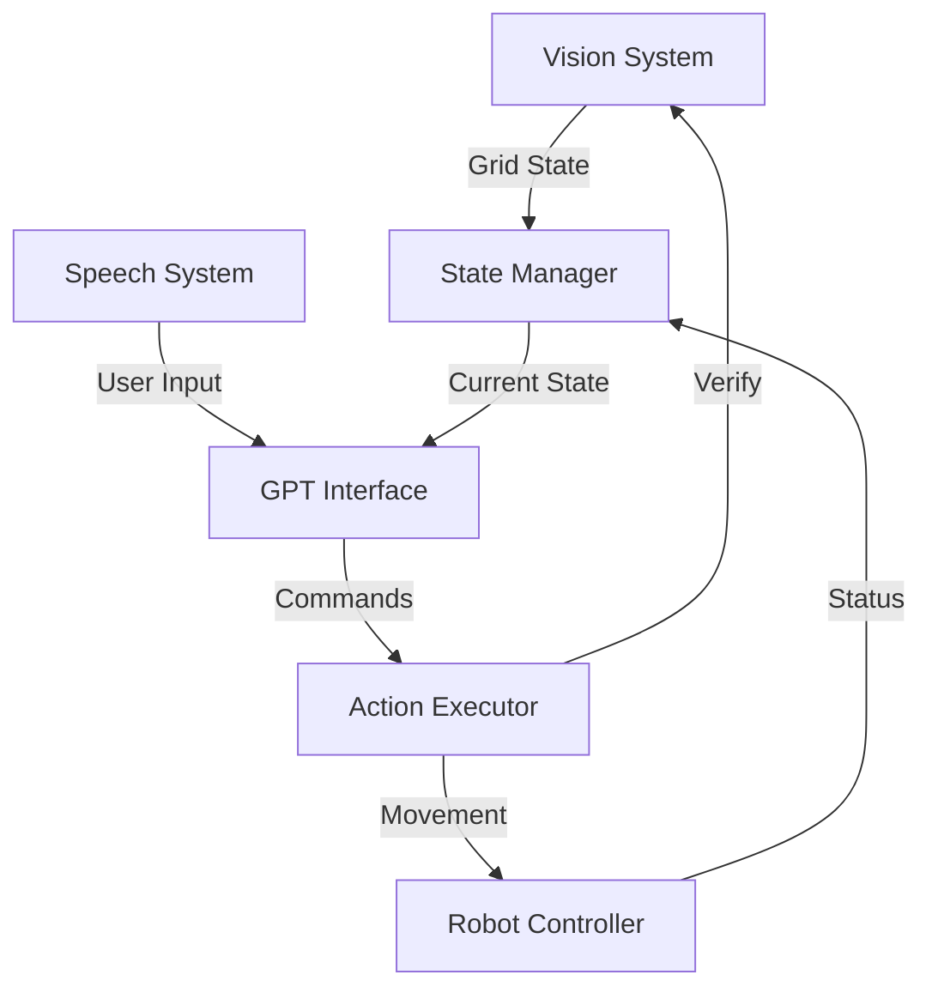

# Robot System Architecture

## 1. System Overview



## 2. Core Components

### 2.1 Vision System
- Uses dual model soft voting for accuracy
- Captures images at key moments:
  * System startup
  * Pre-action verification
  * Post-action verification
  * User state queries
- Image resolution: 230x440
- Provides structured grid state output

#### Key Functions:
```python
def process_image():
    # Load and preprocess image
    # Run both models
    # Perform soft voting
    # Return grid state

def verify_action():
    # Compare before/after states
    # Verify expected changes
    # Return success/failure

def check_image_quality():
    # Verify lighting
    # Check focus
    # Ensure table visibility
```

### 2.2 Speech System
- Uses Google Cloud Speech-to-Text
- 16kHz sampling rate
- English language recognition
- Provides confidence scores

#### Key Functions:
```python
def record_audio():
    # Configure audio settings
    # Record user input
    # Return audio data

def transcribe_speech():
    # Process audio
    # Get transcription
    # Return text with confidence
```

### 2.3 GPT Interface
- Uses GPT-3.5-turbo-instruct
- Maintains conversation context
- Provides mixed guidance:
  * Available commands
  * Current state
  * Error suggestions

#### Command Format:
```json
{
    "action": "grab" | "place",
    "square": 1-12
}
```

### 2.4 Action Executor
- Handles robot movement
- Manages gripper control
- Performs safety checks
- Verifies actions

## 3. ROS Topic Structure

### 3.1 Publishers/Subscribers
```
/camera/color/image_raw     # Camera feed
/vision/grid_state         # Processed state
/audio/speech_input       # User speech
/gpt/response            # GPT output
/robot/command           # Action commands
/robot/status           # Execution status
/system/errors          # Error messages
```

### 3.2 Message Flow
1. Image Processing:
   ```
   camera → vision_node → state_manager
   ```

2. Speech Processing:
   ```
   microphone → speech_node → gpt_node
   ```

3. Command Execution:
   ```
   gpt_node → action_node → robot
   ```

4. Status Updates:
   ```
   robot → state_manager → gpt_node
   ```

## 4. Error Handling

### 4.1 Vision Errors
- Camera issues
- Poor image quality
- Recognition failures

### 4.2 Speech Errors
- Low confidence transcription
- Unclear commands
- Audio quality issues

### 4.3 Action Errors
- Invalid positions
- Motion planning failures
- Gripper problems

## 5. Conversation Flow

### 5.1 Standard Interaction
```
User: "What's on the table?"
Robot: "I see:
- Red triangle in square 1
- Blue circle in square 4
You can ask me to grab or place objects."
```

### 5.2 Command Execution
```
User: "Pick up the red triangle"
Robot: "I'll grab the object from square 1"
[Action execution]
Robot: "Object grabbed successfully"
```

### 5.3 Error Recovery
```
User: "Put it in square 12"
Robot: "I can't reach square 12 safely. Would you like to:
1. Try again
2. Choose a different square
3. Return to start position"
```

## 6. Implementation Plan

### 6.1 Phase 1: Core Setup
1. Configure ROS nodes
2. Set up vision models
3. Implement speech recognition
4. Configure GPT interface

### 6.2 Phase 2: Integration
1. Connect vision system
2. Link speech processing
3. Implement action execution
4. Add state management

### 6.3 Phase 3: Testing
1. Component testing
2. Integration testing
3. Error handling
4. User testing

## 7. File Structure

```
src/
├── gpt_vision/
│   ├── models/
│   │   ├── grid_model_equalized_120epochs.h5
│   │   └── grid_model_unequal_200epoch.keras
│   └── scripts/
│       ├── vision_processing.py
│       └── get_gpt_response.py
├── audio/
│   └── scripts/
│       ├── speech_recognition.py
│       └── speak_gpt.py
└── robot_action/
    └── scripts/
        ├── act_gpt.py
        ├── goto_table_neutral.py
        ├── open_gripper.py
        └── close_gripper.py